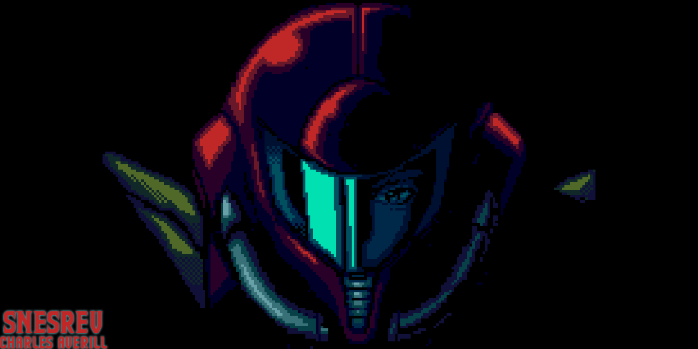

# sm-3ds



This is a (currently non-functional) 3DS port of Super Metroid, based on [the PC port by snesrev](https://github.com/snesrev/sm).

## Building

### Setup

```bash
# Install devkitARM - https://devkitpro.org/wiki/Getting_Started

# Clone
git clone --recurse-submodules https://github.com/CharlesAverill/sm-3ds.git

# Install bannertool
git clone https://github.com/carstene1ns/3ds-bannertool.git --depth=1 && cd 3ds-bannertool
cmake -B build && cmake --build build && sudo cmake --install build
cd ..

# Install makerom
git clone https://github.com/3DSGuy/Project_CTR.git --depth=1
make -C Project_CTR/makerom deps -j
make -C Project_CTR/makerom program -j
sudo cp Project_CTR/makerom/bin/makerom /usr/bin

cd sm-3ds

# Place your copy of Super Metroid in romfs
cp ~/Games/sm.smc romfs

# Do this for whatever reason
sed -i 's/typedef uint32_t uint;//g' sm/src/snes/ppu.c

# Build SDL2
make sdl

# Build sm-3ds
make -j
```

| Make Commands    | Action                                                                                    |
| -----------------| ----------------------------------------------------------------------------------------- |
| make             | 
| make 3ds         | The 3ds target will build a `<project name>.3ds` file.
| make 3dsx        | The 3dsx target will build both a `<project name>.3dsx` and a `<project name>.smdh` files.
| make cia         | The cia target will build a `<project name>.cia` file.
| make azahar      | The azahar target will build a `<project name>.3dsx` file and automatically run azahar.
| make elf         | The elf target will build a `<project name>.elf` file.
| make fbi         | The fbi target will build a `<project name>.cia` file and send it to your 3ds via [FBI].
| make hblauncher  | The hblauncher target will build a `<project name>.3dsx` file and send your 3ds via homebrew launcher.<sup>2</sup>
| make release     | The release target will build `.elf`, `.3dsx`, `.cia`, `.3ds` files and a zip file (.3dsx and .smdh only).<sup>3</sup>
